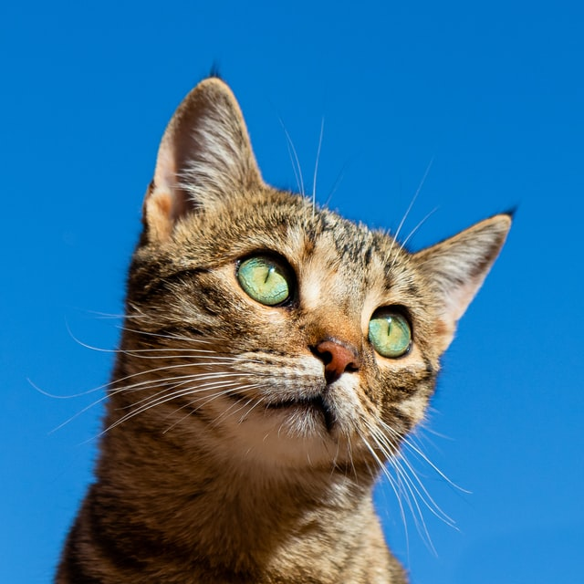
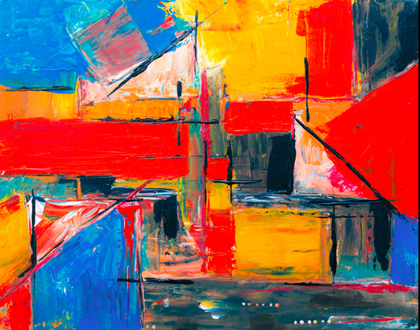
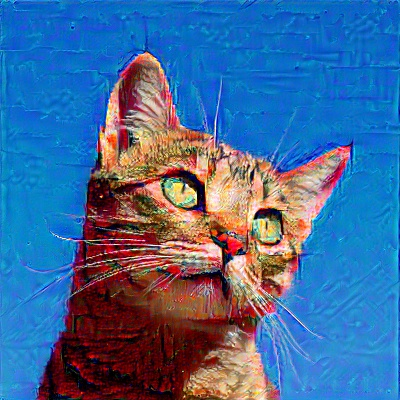
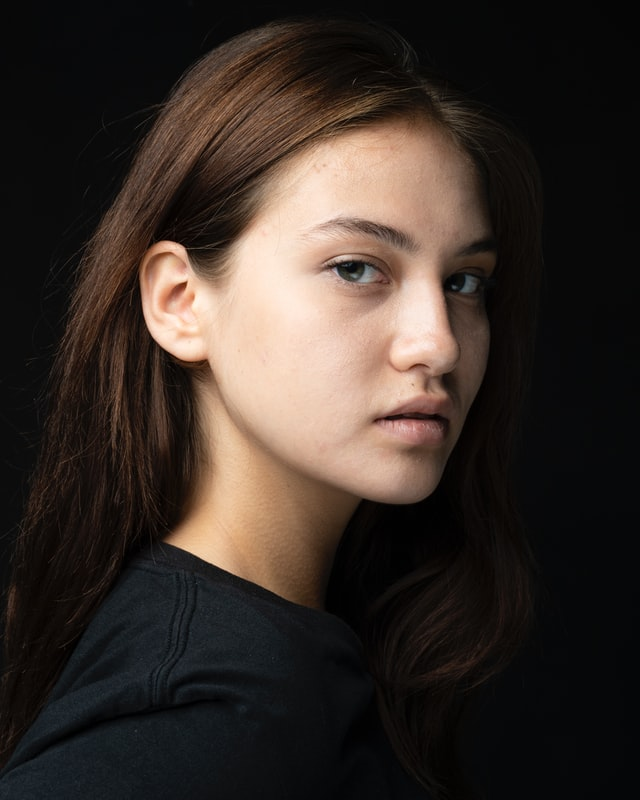
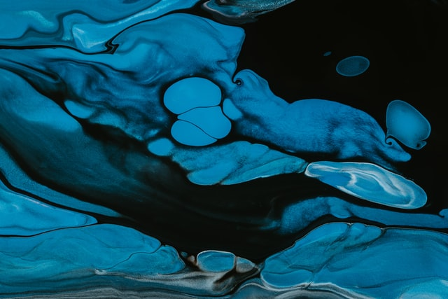
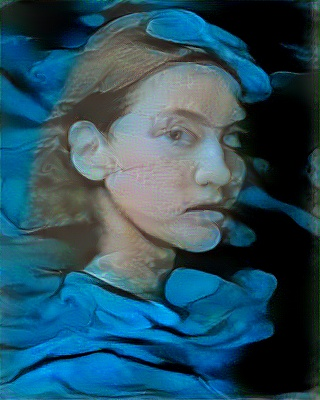

# Neural Style Transfer 🎨

This project implements Neural Style Transfer using TensorFlow and Streamlit. It blends the **content of one image** with the **style of another**, generating beautiful stylized images. The model uses a pre-trained TensorFlow `saved_model.pb` for style transfer.

---

## Project Structure
├── data/
│ ├── content-images/
│ ├── style-images/
│ └── output-images/
├── model/
│ ├── variables/
│ └── saved_model.pb # Pretrained style transfer model
├── notebooks/
│ └── neural_style_transfer.ipynb
├── venv/ # Python virtual environment
├── app.py # Streamlit Web Interface
├── Main.py # Model loading / image processing
├── README.md 
├── req.txt # Python dependencies

###  Step 1: Setup Environment

```bash
# Clone the repo
git clone https://github.com/rahulsm067/Neural-Style-Transfer-pro.git
cd NEURAL-STYLE-TRANSFER

# Create and activate virtual env
python -m venv venv
venv\Scripts\activate

# Install dependencies
pip install -r req.txt

# Run app.py

# if you want to train from scratch go in neural_style_transfer.ipynb and run one by one each cell


## 🖼️ Example

| Original Image | Style Image | Stylized Output |
|----------------|-------------|-----------------|
|  |  |  |

 |  |  |

